# DPA Agent on AWS AgentCore Runtime

This project demonstrates how to deploy a Dynamic Product Advertising (DPA) Agent built with Strands Agents to AWS AgentCore Runtime. The agent specializes in creating product advertising content using Amazon Nova models.

## 🎬 Demo

[Watch the demo video](https://www.youtube.com/watch?v=_dK1NUiU--U)

## 🎯 What This Agent Does

The DPA Agent is a specialized AI assistant for product advertising that can:

### 🎨 Image Generation (Nova Canvas)
- Create professional product advertising images
- Extend product images with new backgrounds (outpainting)
- Edit/modify parts of images (inpainting)
- Optimize prompts for better visual results

### 🎬 Video Creation (Nova Reel) (Work In Progress)
- Generate product showcase videos (up to 6 seconds)
- Support multiple aspect ratios (16:9, 9:16, 1:1)
- Async video generation with status monitoring

### 📝 Content & Analysis (Nova Pro)
- Generate marketing copy and product descriptions
- Analyze product images for advertising effectiveness
- Provide creative optimization suggestions

## 🏗️ AWS Architecture

```mermaid
graph TB
    User[👤 User] --> DPA[🎨 DPA Agent<br/>Strands Framework]
    
    
    AC --> DPA[🎨 DPA Agent<br/>Strands Framework]
    DPA --> MCP[🔧 MCP Server<br/>Nova Tools]
    
    MCP --> Nova1[🎨 Nova Canvas<br/>Image Generation]
    MCP --> Nova2[🎬 Nova Reel<br/>Video Creation] 
    MCP --> Nova3[📝 Nova Pro<br/>Text Analysis]
    
    DPA --> S3[🪣 S3 Bucket<br/>Asset Storage]
    S3 --> CF
    
    subgraph "AWS Services"
        AC[🤖 AgentCore Runtime]
        S3
        CF[☁️ CloudFront Distribution]
        Nova1
        Nova2
        Nova3
        CDN --> MCP
    end
    
    subgraph "Generated Assets"
        S3 --> Images[🖼️ Product Images]
        S3 --> Videos[🎥 Product Videos]
        S3 --> Copy[📄 Marketing Copy]
    end
    
    CF --> CDN[🌐 Global CDN<br/>Asset Delivery]
```



## 🔧 Local MCP Development

To use the DPA MCP server locally with MCP-compatible clients:

### Configuration File (`mcp.json`)
```json
{
  "mcpServers": {
    "dpa-server": {
      "command": "python",
      "args": ["/path_to_your_dir/dpa_mcp_server.py"],
      "env": {
        "AWS_DEFAULT_REGION": "us-east-1",
        "DPA_S3_BUCKET": "your-s3-bucket-name",
        "CLOUDFRONT_DOMAIN": "your-cloudfront-domain"
      }
    }
  }
}
```

### Available MCP Tools
- `generate_image` - Create product advertising images with Nova Canvas
- `generate_video` - Create product videos with Nova Reel  
- `analyze_image` - Analyze product images with Nova Pro
- `optimize_prompt` - Enhance image generation prompts

### Usage with MCP Clients
```bash
# Install MCP client (example with Claude Desktop)
# Add the mcp_config.json to your MCP client configuration

# Test the server directly
python dpa_mcp_server.py
```

## 📁 Project Structure

```
dpa-agent/
├── dpa_agent.py                # Strands agent
├── dpa_mcp_server.py           # MCP server with Nova tools
├── requirements.txt            # Requirements for deployment
├── deploy_to_agentcore.md      # Detailed deployment guide
├── __init__.py                 # Python package marker
└── README.md         # This file
```

## 🚀 Quick Start

### 1. Prerequisites

- AWS Account with credentials configured
- Python 3.10+ installed
- Amazon Bedrock model access enabled for:
  - Anthropic Claude Sonnet 4.0
  - Amazon Nova Canvas, Reel, and Pro

### 2. Configure S3 Storage

Set up an S3 bucket for storing generated images. You can either:

**Option A: Use deployment script (Recommended)**
```bash
# Create or edit .env file
sh ./cfn/deploy-assets.sh
```

**Option B: Manually create on AWS Console**

The deployment script will create the bucket if it doesn't exist.

### 3. Install Dependencies

```bash
pip install --upgrade pip
pip install bedrock-agentcore-starter-toolkit
pip install -r requirements.txt
```

### 4. Deploy to AWS

```bash
# Configure
agentcore configure -e dpa_agent.py

# Deploy
agentcore launch

# Test
agentcore invoke '{"prompt": "Create a luxury watch advertisement"}'
```

### 5. Check your Agentcore IAM role

Add `s3:putObject` and `s3:getObject` permission to runtime role.

### 6. Use Your Deployed Agent

```python
import boto3
import json
import uuid

client = boto3.client('bedrock-agentcore')

response = client.invoke_agent_runtime(
    agentRuntimeArn="your-agent-arn",
    sessionId=str(uuid.uuid4()),
    inputText=json.dumps({
        "prompt": "Generate a professional product image of running shoes in an urban setting"
    })
)

# Process streaming response
for event in response['completion']:
    if 'chunk' in event:
        chunk = event['chunk']
        if 'bytes' in chunk:
            print(chunk['bytes'].decode('utf-8'), end='')
```

## 🔧 Configuration

### Environment Variables

- `MCP_SERVER_PATH`: Path to MCP server (default: `./dpa_mcp_server.py`)
- `AWS_DEFAULT_REGION`: AWS region for Bedrock models
- `LOG_LEVEL`: Logging level (DEBUG, INFO, WARNING, ERROR)
- `DPA_S3_BUCKET`: S3 bucket name for storing generated images (required for production)

### Model Configuration

The agent uses these models by default:
- **Primary Model**: `us.anthropic.claude-sonnet-4-20250514-v1:0`
- **Image Generation**: Amazon Nova Canvas
- **Video Generation**: Amazon Nova Reel  
- **Text Analysis**: Amazon Nova Pro


## 🎨 Example Use Cases

### Product Image Generation
```json
{
  "prompt": "Create a professional advertising image for a coffee mug in a cozy kitchen setting with warm lighting"
}
```
*Response includes S3 presigned URL for 24-hour access to the generated image.*

### Single Image Upload
```json
{
  "prompt": "Replace the background with a modern office environment while keeping the headphones unchanged",
  "image": "base64_encoded_image_data",
  "image_filename": "headphones.jpg"
}
```

### Multiple Images Upload
```json
{
  "prompt": "Use the first image as the product and the second as background reference. Create a professional advertising image.",
  "images": [
    {
      "data": "base64_encoded_product_image",
      "filename": "product.jpg"
    },
    {
      "data": "base64_encoded_background_image", 
      "filename": "background.jpg"
    }
  ]
}
```

### Virtual Try-On (Multiple Images)
```json
{
  "prompt": "Perform virtual try-on using the person and garment images",
  "images": [
    {
      "data": "base64_encoded_person_image",
      "filename": "person.jpg"
    },
    {
      "data": "base64_encoded_garment_image",
      "filename": "garment.jpg"
    }
  ]
}
```

*Upload multiple images for complex advertising tasks like virtual try-on, background replacement, or image comparison.*


## 📚 Additional Resources

- [AWS AgentCore Documentation](https://docs.aws.amazon.com/bedrock-agentcore/)
- [Strands Agents SDK](https://strandsagents.com/)
- [Amazon Nova Models](https://docs.aws.amazon.com/bedrock/latest/userguide/nova-models.html)
- [Model Context Protocol](https://modelcontextprotocol.io/)


## 📄 License

This project is licensed under the MIT License - see the LICENSE file for details.

---

